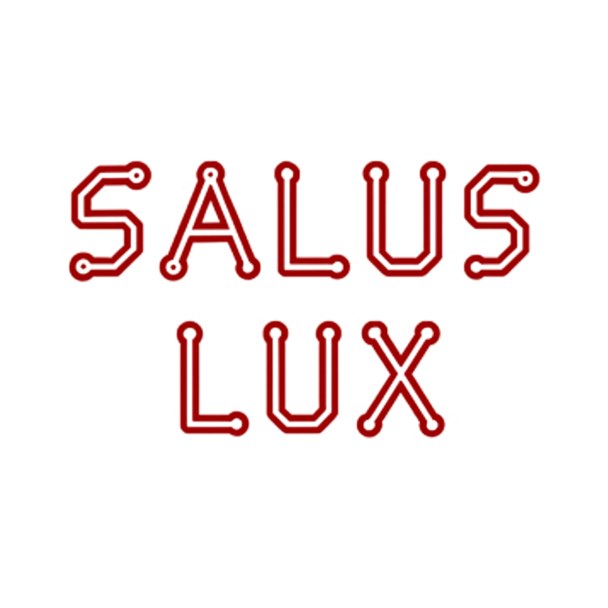
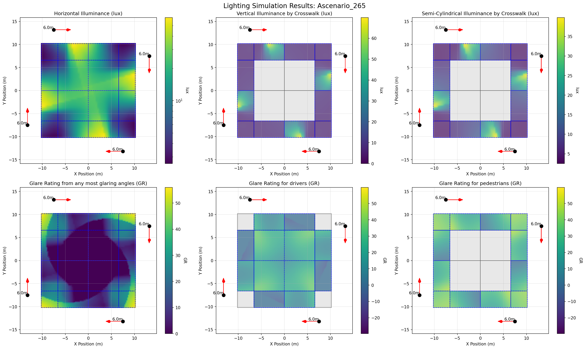

# SALUSLux

 

**SALUSLux** is an open-source Python package for simulating and optimizing urban street lighting, with a focus on pedestrian safety and light pollution mitigation. Designed for researchers, engineers, and city planners, SALUSLux brings full programmatic control to the lighting simulation process using standardized IES photometric data.

(We also published the project to https://pypi.org/project/saluslux/)

> **Built by the SALUS Lab at Carnegie Mellon University**  
> [SALUSLab Website](https://www.flanigansaluslab.com) License: Apache-2.0

---

## Key Features

- **Parse IES Files** (ANSI/IES LM-63-19 format) to extract luminous intensity data  
- **Compute Illuminance**: Horizontal, vertical, and semi-cylindrical, using vector-based physics  
- **Simulate Luminance**: With realistic Lambertian surface assumptions  
- **Evaluate Glare**: Compute CIE glare rating (GR) from pedestrian or driver perspectives  
- **Intersection Simulation**: Analyze full crosswalk layouts with 16 surfaces and 6 metrics  
- **Modular & Extensible**: Designed for easy integration into smart city, ML, or parametric design tools  

---
### Requirements

SALUSLux uses the following Python packages:

```
numpy, scipy, matplotlib, pandas
```

---

## Quick Start

Import the library:

```python
import saluslux as slux
```

Example: Parse an IES file and compute illumination on a surface:

```python
data = slux.parse_ies('example.ies')
grid = slux.generate_unified_grid(100, [(-10, 10, -10, 10)])
Eh = slux.compute_illuminance(grid, data['sources'], normal_vector=[0, 0, 1])
```


---

## Why SALUSLux?

Mainstream lighting tools like Revit or DIALux are GUI-heavy and proprietary. SALUSLux:

- Empowers **reproducible scientific workflows**
- Enables **large-scale parametric simulations**
- Avoids license limitations with **fully open photometric parsing**

---
## Citation

If you use SALUSLux in your research, please cite:

- **Human-Centered Simulation of Intersection Lighting: A Parametric Study of Design Tradeoffs** https://www.sciencedirect.com/science/article/pii/S2542660526000661

- **2025 IEEE International Smart Cities Conference (ISC2)** https://ieeexplore.ieee.org/abstract/document/11293286 

- **Tecnical Report in Bureau of Transportation Statistics (BTS)'s National Transportation Library** https://rosap.ntl.bts.gov/view/dot/86297

```
@article{KAVEE2026101936,
title = {Human-Centered Simulation of Intersection Lighting: A Parametric Study of Design Tradeoffs},
journal = {Internet of Things},
pages = {101936},
year = {2026},
issn = {2542-6605},
doi = {https://doi.org/10.1016/j.iot.2026.101936},
url = {https://www.sciencedirect.com/science/article/pii/S2542660526000661},
author = {Korawich Kavee and Katherine A. Flanigan and Stephen L. Quick},
keywords = {Glare, human-centered infrastructure, intersection lighting, light pollution, light trespass, lighting design tradeoffs, open-source software, pedestrian visibility, photometric analysis, SALUSLux},
abstract = {Pedestrian safety in urban environments remains a critical public health issue, with nighttime conditions substantially increasing crash risk for vulnerable road users. Yet intersection lighting design remains constrained by roadway-centric standards and static workflows, offering limited support for evaluating tradeoffs among multidirectional pedestrian visibility, glare, and light trespass—and environmentally sensitive designs are often presumed, without evidence, to compromise safety. We introduce SALUSLux, an open-source, programmable simulation toolkit for pedestrian-centered intersection lighting analysis, and apply it to a parametric study of 2,304 configurations on a standard four-way intersection. Results reveal three findings with direct implications for practice and standards. First, spatial geometry and luminaire properties interact so strongly that they cannot be optimized independently—a luminaire that performs well in one configuration can fail in another, making joint design-space exploration essential. Second, semi-cylindrical illuminance was the most difficult metric to satisfy across all scenarios and should be elevated to a required standard for intersection crosswalks; horizontal illuminance—the dominant metric in current practice—provided little additional information once other criteria were met, and overreliance on it risks encouraging excessive lighting that increases glare without improving pedestrian safety. Third, warm-color 2,700K lighting fully satisfies all pedestrian visibility thresholds when paired with appropriate spatial configuration, directly contradicting the assumed safety-sustainability tradeoff. Together, these findings provide an evidence base for intersection-specific lighting criteria that existing tools cannot deliver.}
}
```

---

## Tutorial and Workshop

- [SALUSLux Tutorial 1 — lighting a light](https://korawichmawinkavee.medium.com/saluslux-tutorial-1-lighting-a-light-14400decfecd)

## Presentation 
- [2.20.26 - Katherine Flanigan](https://www.youtube.com/watch?v=DFYq7BrMwwY) 44:10 
- [Pedestrian and Street Lighting: 2.20.26 - Katherine Flanigan: Safety21 Talks Edit Archive](https://www.youtube.com/watch?v=TRy9TK4j260) 29:50

PS - put stars ⭐️ on the GitHub repo!
